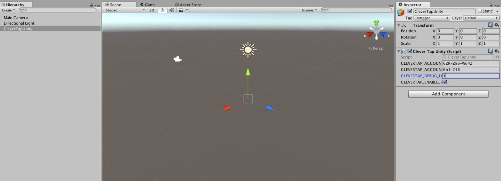
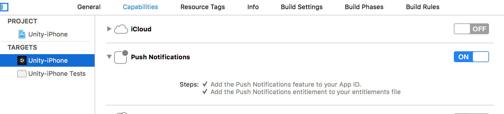
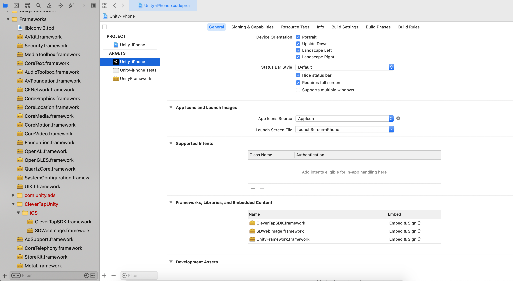
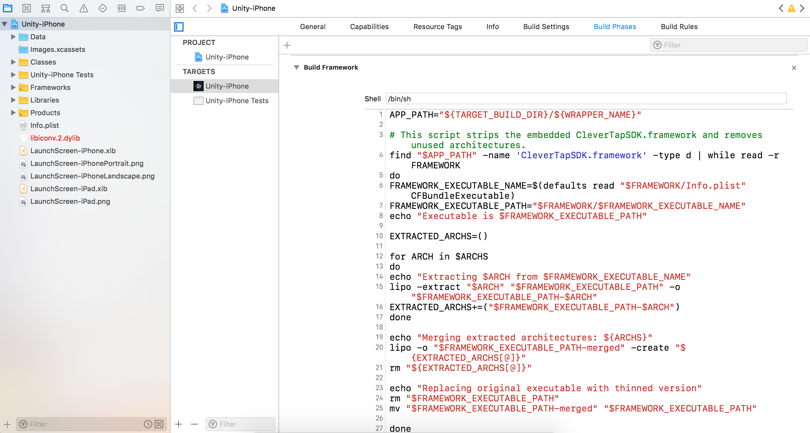

<p align="center">
    
</p>


# CleverTap Unity Plugin
[](https://codebeat.co/projects/github-com-clevertap-clevertap-unity-sdk-master)
<a href="https://github.com/CleverTap/clevertap-unity-sdk/releases">
    
</a>

## 👋 Introduction

The CleverTap Unity Plugin for Mobile Customer Engagement and Analytics solutions.

For more information check out our [website](https://clevertap.com/ "CleverTap")  and  [documentation](https://developer.clevertap.com/docs/ "CleverTap Technical Documentation").

To get started, sign up [here](https://clevertap.com/live-product-demo/).

## 🛠 Installation and Setup #

1. Import the CleverTapUnityPlugin.unitypackage into your Unity Project (`Assets` > `Import Package` > `Custom Package`) or manually Copy `Plugin/CleverTapUnity`, `Plugin/PlayServicesResolver` and `Plugin/Plugins/Android` (or copy the files in `Plugin/Plugins/Android` to your existing `Assets/Plugins/Android` directory) into the Assets directory of your Unity Project.

2. Create an empty game object (GameObject -> Create Empty) and rename it `CleverTapUnity`. Add `Assets/CleverTapUnity/CleverTapUnity-Scripts/CleverTapUnity.cs` as a component of the `CleverTapUnity GameObject`. 

| NOTE: To receive the SDK callbacks the name of the game object must be `CleverTapUnity` |
| --- |

   

3. Select the `CleverTapUnity GameObject` you created in the Hierarchy pane and add your CleverTap settings inside the Inspector window. You must include your `CleverTap Account ID` and `CleverTap Account Token` from your [CleverTap Dashboard -> Settings](https://dashboard.clevertap.com/x/settings.html).

4. Edit `Assets/CleverTapUnity/CleverTapUnity-Scripts/CleverTapUnity.cs` to add your calls to CleverTap SDK.  See usage examples in [example/CleverTapUnity.cs](example/CleverTapUnity.cs).  For more information check out our [documentation](https://developer.clevertap.com/docs "CleverTap Technical Documentation").

### 👩‍💻 iOS Specific Instructions:
- If you want to enable Push Notifications, be sure to add the Push Notifications capability to your Xcode project.  

    
    
- Configure the Framework
   - In Xcode, go to your Targets, under your app’s name
   - Under General, Navigate to Frameworks, Libraries and Embedded Content, please ensure that **CleverTapSDK** and **SDWebImage** frameworks are marked as **Embed & Sign** and **Embedded** to your project.
   
 

- Required for CleverTap Unity v2.1.0 or below: Add a run script to your build phases, In Xcode, go to your Targets, under your app’s name, select Build Phases after   embed frameworks, add a run script phase and set it to use `/bin/sh` and the [script found here](https://github.com/CleverTap/clevertap-unity-sdk/blob/master/Plugin/CleverTapUnity/iOS/strip.sh).

The script will look through your built application’s `Frameworks` folder and strip out the unnecessary simulator architectures from the CleverTakSDK.framework prior to archiving/submitting the app store.

  
  

- Build and run your iOS project.

### 👨‍💻 Android Specific Instructions:
- If you want to enable Push Notifications, be sure to add the Firebase Unity SDK to your app as described in the [Firebase Unity Setup Docs](https://firebase.google.com/docs/unity/setup)
  
> NOTE: On adding the Firebase Unity SDK it might cause your AndroidManifest.xml to be overriden. If that occurs, make sure to revert it your original manifest file.

- Add latest `Play Services Resolver` package from [here](https://github.com/googlesamples/unity-jar-resolver). Ignore if it's already there in the project.

- Run `Assets` > `Play Services Resolver` > `Android Resolver` > `Resolve Client Jars` from the Unity menu bar to install the required google play services and android support library dependencies.

- Edit the `AndroidManifest.xml` file in `Assets/Plugins/Android` to add your Bundle Identifier, FCM Sender ID, CleverTap Account Id, CleverTap Token and Deep Link url scheme (if applicable): 

    ```
    <manifest xmlns:android="http://schemas.android.com/apk/res/android" package="YOUR_BUNDLE_IDENTIFIER" android:versionName="1.0" android:versionCode="1" android:installLocation="preferExternal"> <supports-screens android:smallScreens="true" android:normalScreens="true" android:largeScreens="true" android:xlargeScreens="true" android:anyDensity="true" />
    ```
    ```
    <meta-data
        android:name="FCM_SENDER_ID"
        android:value="id:YOUR_FCM_SENDER_ID"/>
    
    <meta-data
        android:name="CLEVERTAP_ACCOUNT_ID"
        android:value="Your CleverTap Account ID"/>
        
    <meta-data
        android:name="CLEVERTAP_TOKEN"
        android:value="Your CleverTap Account Token"/>
    ```

    ```
    <!-- Deep Links uncomment and replace YOUR_URL_SCHEME, if applicable, or remove if not supporting deep links-->
    <!--
        <intent-filter android:label="@string/app_name">
        <action android:name="android.intent.action.VIEW" />
        <category android:name="android.intent.category.DEFAULT" />
        <category android:name="android.intent.category.BROWSABLE" />
        <data android:scheme="YOUR_URL_SCHEME" />
        </intent-filter>
    -->  
    ```

- Add the following in the `AndroidManifest.xml` file, if not there already  - 

    ```
        <service
            android:name="com.clevertap.android.sdk.pushnotification.fcm.FcmMessageListenerService"
            android:exported="true">
            <intent-filter>
                <action android:name="com.google.firebase.MESSAGING_EVENT"/>
            </intent-filter>
        </service>
    ```

- Add your `google-services.json` file to the Assets folder of the project.

- To enable A/B UI editor, edit `Assets/CleverTapUnity/CleverTapUnity-Scripts/CleverTapBinding.cs` and `CleverTapAPI.CallStatic("setUIEditorConnectionEnabled", true)` call just before getting the clevertap instance.

**Code snippet for the same:**

```
public static AndroidJavaObject CleverTap {
        get {
            if (clevertap == null) {
                AndroidJavaObject context = unityCurrentActivity.Call<AndroidJavaObject>("getApplicationContext");
                
                //set the UI editor flag before getting the Clevertap instance, defaults to false.
                CleverTapAPI.CallStatic("setUIEditorConnectionEnabled", true);
                
                clevertap = CleverTapAPI.CallStatic<AndroidJavaObject>("getInstance", context);
            }
            return clevertap;
        }
    }
```
- Build your app or Android project as usual.

## 💻 Example Usage #

A [demo application](https://github.com/CleverTap/clevertap-unity-sdk/tree/master/example) showing the integration of our Plugin.

## 🆕 Changelog #

Check out the CleverTap Unity plugin SDK [Change Log](https://github.com/CleverTap/clevertap-unity-sdk/blob/master/CHANGELOG.md) here.

## ⁉️ Questions? #

 If you have questions or concerns, you can reach out to the CleverTap support team from the CleverTap Dashboard. 
 
**TroubleShooting Guide:** Please refer [here](https://github.com/CleverTap/clevertap-unity-sdk/blob/master/Troubleshooting.md) if you are facing common integration issue.
