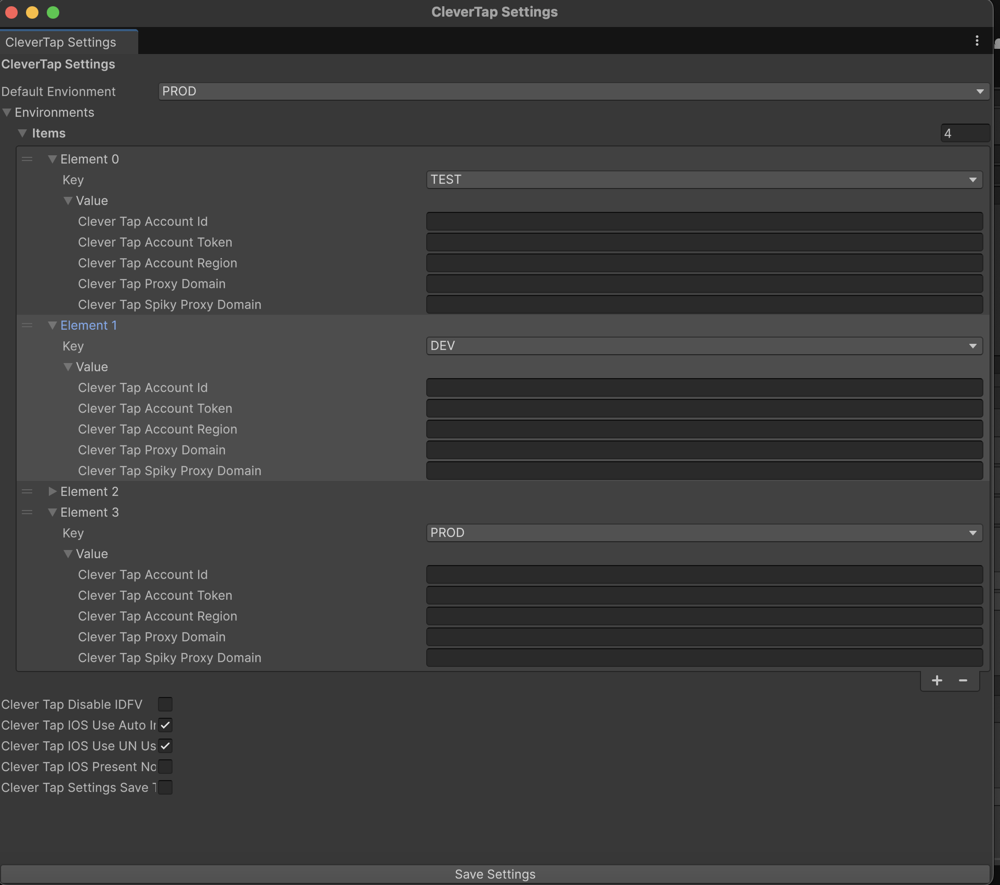

# CleverTap Unity SDK - Multi-Environment Crendential Support

## Overview
The CleverTap Unity SDK supports multi-environment configuration, allowing you to manage different CleverTap environments (TEST, DEV, STAGE, PROD, and custom environments) within a single Unity project. This feature streamlines development workflows by enabling easy switching between different configurations.



## 🚀 Key Features
- Multiple Environment Management: Configure separate credentials for TEST, DEV, STAGE, and PROD environments

- Custom Environment Support: Create your own environment keys beyond the default ones

- Development Build Switching: Easily switch between environments during development

- Release Build Safety: Automatically uses default environment in release builds

- Platform Support: Works on both iOS and Android platforms

- Editor Integration: Manage all environments through Unity Editor UI

## 🛠️ Configuration
### 1. Accessing Settings
Open the CleverTap Settings window in Unity:

Menu: ```Assets → CleverTap Settings```
Or right-click in Project window and select ```CleverTap Settings```


### 2. Default Environment Configuration
Configure each predefined environment (TEST, DEV, STAGE, PROD):

1.Select the default environment from the dropdown

2.Expand each environment in the list to configure:

- CleverTap Account Id: Your CleverTap Project ID

- CleverTap Account Token: Your CleverTap Project Token

- CleverTap Account Region (Optional): Region code for regional endpoints

- CleverTap Proxy Domain (Optional): Custom proxy domain

- CleverTap Spiky Proxy Domain (Optional): Spiky proxy domain

### 3. Creating Custom Environments
You can create custom environment keys beyond the default ones. Here's how:
If you need custom environments in code, extend the ```CleverTapEnvironmentKey``` enum:

```csharp
// Add to CleverTapEnvironment.cs
public enum CleverTapEnvironmentKey
{
    TEST = 0,
    DEV = 1,
    STAGE = 2,
    PROD = 3,
    QA = 4,          // Custom QA environment
    UAT = 5,         // User Acceptance Testing
    DEMO = 6         // Demo environment
}

```
### 4. Save Settings
Click "Save Settings" to persist your configuration.

- Assets/CleverTapSettings.asset - enable ```CleverTapSettingsSaveToJSON``` and click ```Save Settings```

- ```StreamingAssets/CleverTapSettings.json``` will be created.


## 🔄 Runtime Environment Switching

##### For Development Builds Only
```csharp
// Switch to a different environment
if (Debug.isDebugBuild)
    // Using predefined environments
   CleverTapSDK.YourClassName.SelectCleverTapEnvironmentCredential(CleverTapEnvironmentKey.DEV);
```

## 🔄 Migrating from Old CleverTap Settings to Multi-Environment Support

### ⚠️ Important Notice
If you were using the old CleverTap settings system (single environment configuration), you need to re-enter your credentials in the new multi-environment settings format. The new system stores credentials differently to support multiple environments.

### 📋 Migration Steps

#### Step 1: Access the New Settings Window
Open Unity Editor

Go to Assets → CleverTap Settings

Or search for "CleverTap Settings" in the Project window

#### Step 2: Locate Your Old Credentials and Re-enter Credentials in New Format

- Find your current CleverTap credentials from one of these locations:

- Source	Location
old Settings File	```Assets/CleverTapSettings.asset``` (if exists)

#### For PROD Environment (Minimum Required):
- In the CleverTap Settings window, select ```Default Environment" → "PROD```
- In the CleverTap Settings window, expand ```Environments" → PROD``` if not available create a element in the list and select ```Key -> PROD```

- Fill in the following fields with your production credentials:

```text
Clever Tap Account Id:     [Your PRODUCTION Account ID]
Clever Tap Account Token:  [Your PRODUCTION Account Token]
Clever Tap Account Region: [Optional - Your region if applicable]
Clever Tap Proxy Domain:   [Optional]
Clever Tap Spiky Proxy Domain: [Optional]
```
##### If you get ⚠️ Error loading settings - try ```Go to Assets → CleverTap Settings```
